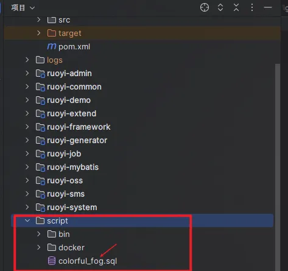
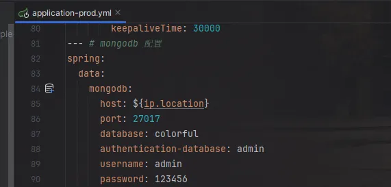
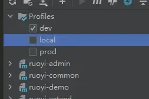
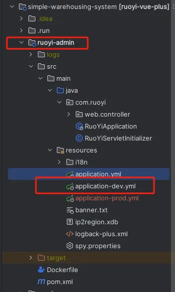
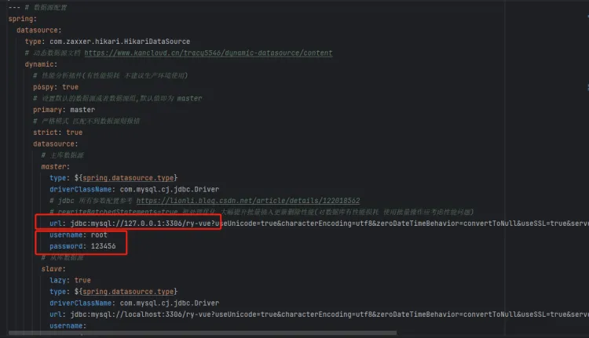
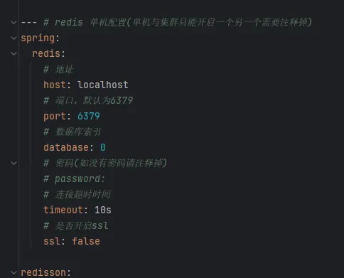
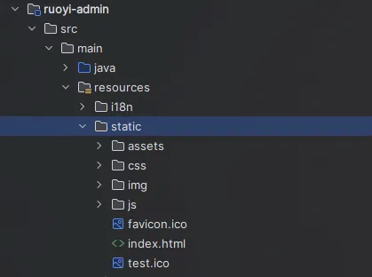
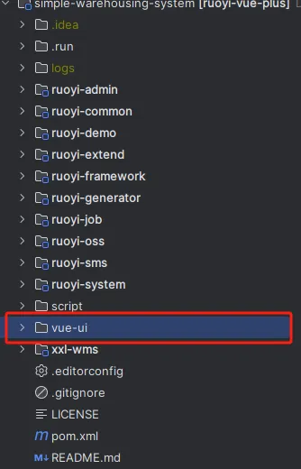

项目必备环境：

● openjdk-8/17
● mysql 5.7 8.0 (5.6未适配可能会有问题)
● redis 5.X 6.X 7.X 由于框架大量使用了redis特性 版本必须 >= 5.X (win redis 下载地址)
● mongodb 7.0.X
● maven >= 3.8.X
后端准备
数据库准备：
MySQL：
sql导入:script/colorful_fog.sql

往你的mysql里执行这个脚本
Mongodb
创建数据库和用户权限，这里默认配置是colorful和admin用户

启动准备
勾选对应maven环境

修改配置文件，路径： ruoyi-admin/src/main/resources/application.yml

填写对应的数据库地址和redis地址 然后运行即可

前端启动
直接访问
本项目为已将前端打包放进：

直接启动springboot项目，通过：
http://127.0.0.1:8834/index.html 即可访问
超级管理员账号密码：
admin
admin123
前后端分离部署前端项目代码在以下路径中:
/vue-ui

运行前端：
npm install --legacy-peer-deps
ps 后缀必须加 --legcy-peer-deps 因为有些插件目前npm已经不再支持或更新，需要强制下载旧版本或遗弃版本，不影响正常使用
2、打开 /applications/sys/public/pbRequest/index.js 更换baseUrl，具体Url跟后端沟通即可
