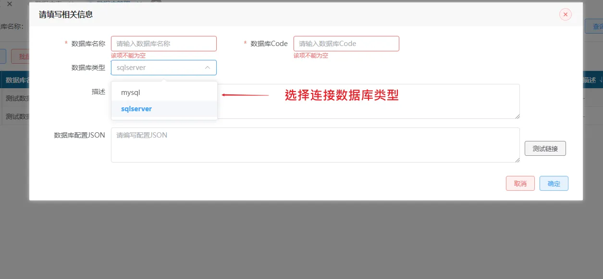
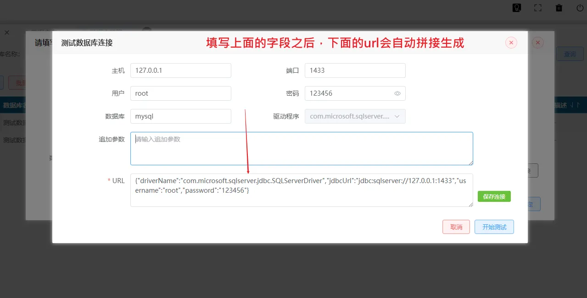
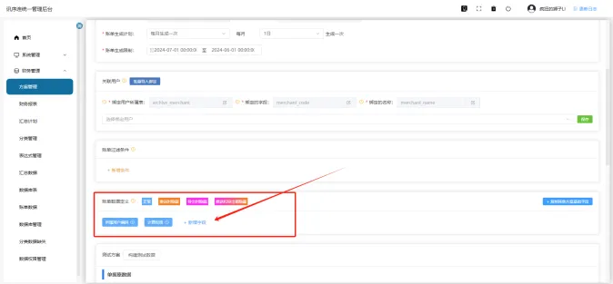
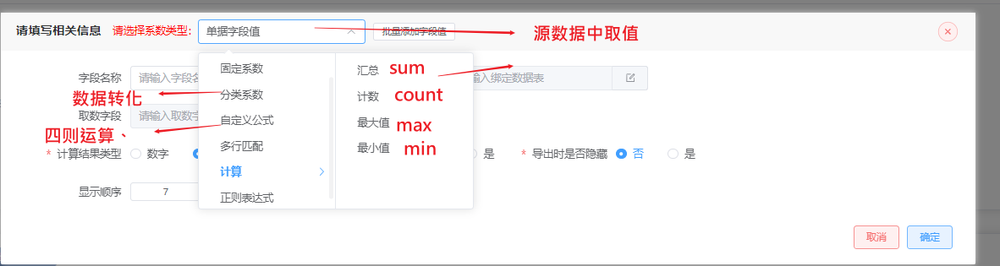
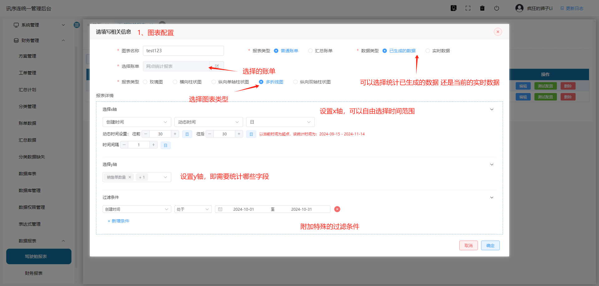
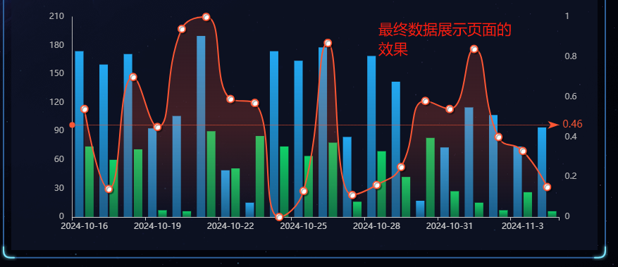
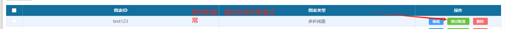

##  **项目介绍：** 

基于ruoyi框架的拓展系统，继承ruoyi框架的基本功能。拓展了自定义报表功能，适用于开发ERP、WMS、TMS等系统。开发者可以在ruoyi框架的基础上开发基础的业务逻辑，开发完后使用报表模块通过无代码的方式生成报表功能、账单功能、数据图表、数据大屏功能。报表功能配置好后，还可以交由业务人员自行定制，减少沟通成本和开发成本。

##  **项目试用：** 

可以以游客的身份进去试用一下功能：

http://8.138.143.21:8088/index

账号：guest

密码：guest

## 功能展示

此部分仅展示系统主要功能理解本系统功能，详细操作说明请看<a href="#shuoming">操作说明</a>部分

### 连接数据库

支持数据库

- SQL Server

- MySQl

#### 基本操作

- 进入数据库管理，添加数据库基本信息，数据库名称和英文名称

- 添加数据库试用的库和连接账号

- 填写完之后，点击开始测试。测试连接没有问题之后，即可保存当前连接记录，后续的操作都需要使用到

### 中间省略操作

添加表单字段和外键关联关系，后续制作报表需要用到

### 制作报表方案

账单需要展示哪些字段内容，用户可以自定义字段的名称，来源，并对字段做一定的计算。在设置完账单数据后，可以点击下方测试方案的“构建测试数据”，来查看生成的账单数据情况，做一个预览。

图 9 新增账单数据字段

报表的字段类型有多种可选项：

### 制作数据大屏

选取对应的方案中的字段作为横纵坐标，生成数据大屏图表

生成样例：

配置完成后可以测试看配置是否正确

## <a id="shuoming">操作说明</a>

详细的操作说明文档：

http://doc.baiaidu.com/web/#/687049981

## 部署流程

### 环境准备：

● openjdk-8/17

● mysql 5.7 8.0 (5.6未适配可能会有问题)

● redis 5.X 6.X 7.X 由于框架大量使用了redis特性 版本必须 >= 5.X 

● mongodb 7.0.X

● maven >= 3.8.X

### 后端准备

#### 数据库准备：

##### MySQL：

sql导入:script/colorful_fog.sql 
当前sql脚本包含ruoyi基本数据库表，report功能表，执行当前脚本将创建colorful_fog数据库以及相关表单
sql导入：script/testdatabase.sql
本脚本为测试数据脚本，用于测试学习报表功能，执行当前脚本将创建testdatabase数据库以及相关表单

往你的mysql里执行这个脚本

##### Mongodb

创建数据库和用户权限，这里默认配置是colorful和admin用户

启动准备
勾选对应maven环境

修改配置文件，路径： ruoyi-admin/src/main/resources/application.yml

填写对应的数据库地址和redis地址 然后运行即可

### 前端启动

#### 直接访问

本项目为已将前端打包放进：

直接启动springboot项目，通过：

http://127.0.0.1:8834/index.html 即可访问

超级管理员账号密码：

admin

admin123

#### 前后端分离部署

前后端分离部署前端项目代码在以下路径中:

/vue-ui

运行前端：
npm install --legacy-peer-deps

ps 后缀必须加 --legcy-peer-deps 因为有些插件目前npm已经不再支持或更新，需要强制下载旧版本或遗弃版本，不影响正常使用

2、打开 /applications/sys/public/pbRequest/index.js 更换baseUrl，具体Url跟后端沟通即可

[#shuoming]: 
[#操作说明]: 

## License

[MIT](http://opensource.org/licenses/MIT)

## 联系我吧

添加微信时请备注：report或报表说明来意，十分感谢

